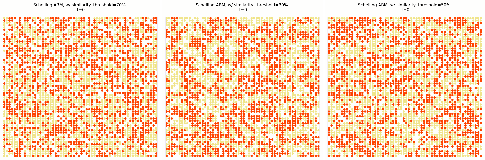

# Self-Organised Language Agents (SOLA) framework


SOLA is a framework for studying self-organization in artificial systems using large language models (LLMs) as agents. 
This repository contains the implementation and experiments described in our paper: 
"Self-Organised Language Agents (SOLA): Probing Language as a Substrate for Self-Organization in Artificial Systems".


## Overview
SOLA situates LLM agents on a structured topology where they iteratively perceive their local neighborhood, update their internal state, and communicate through language-based interactions. Unlike traditional models with explicit rules, our approach leverages emergent dynamics shaped by language priors and contextual processing.
In SOLA, each LLM-based agent iteratively:
- Perceives its local neighborhood by retrieving and interpreting incoming information
- Updates its internal state according to its perception
- Shares information with its neighbors

## Models
The repository includes implementations of two key models:
### Schelling Segregation Model
An implementation of a segregation model using LLM agents, leading to emergent segregation patterns.


### Self-Classifying MNIST Experiments
Inspired by Randazzo et al., this experiment investigates collective intelligence capabilities of language-based agents in pattern recognition tasks.


## Installation
- Clone the Repository
- Create and activate a virtual environment (recommended)
```
python -m venv venv
source venv/bin/activate  # On Windows: venv\Scripts\activate
```
- Install dependencies
```
pip install -r requirements.txt
```

- For the LLM, you need to provide your API key in the appropriate configuration file within the config/ folder:
For OpenAI:
Create a file named openai.yml in the config/ folder. It should contain your key in the following format:
```
openai_api_key: <YOUR_OPENAI_KEY>
```
For Anthropic:
Create a file named anthropic.yml in the config/ folder. It should contain your key in the following format:
```
anthropic_api_key: <YOUR_ANTHROPIC_KEY>
```

### Quick Run 

Currently two main models are implemented: a Schelling-inspired model, denoted 'schelling' (to be found in models/schelling/) and a self-classifying model denoted 'classifier' (to be found in models/classifier/)

To run an experiment, you can simply run:
```
python3 main.py -xp <MODEL_NAME>
```

For instance, for LLM Schelling model:
```
python3 main.py -xp schelling
```

## Configuration
Each model in SOLA can be configured by different parameters. 
You can find the config files both for the schelling and classifier experiment in config/.

##TBC