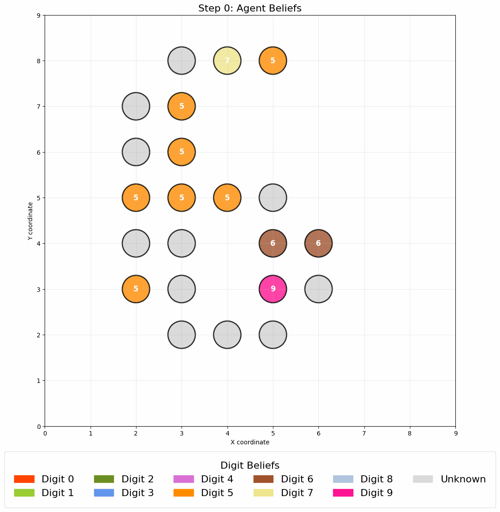

# Self-Organised Language Agents (SOLA) framework


SOLA is a framework for studying self-organization in artificial systems using large language models (LLMs) as agents. 
This repository contains the implementation and experiments described in our paper: 
"Self-Organised Language Agents (SOLA): Probing Language as a Substrate for Self-Organization in Artificial Systems".


## Overview
SOLA situates LLM agents on a structured topology where they iteratively perceive their local neighborhood, update their internal state, and communicate through language-based interactions. Unlike traditional models with explicit rules, our approach leverages emergent dynamics shaped by language priors and contextual processing.
In SOLA, each LLM-based agent iteratively:
- Perceives its local neighborhood by retrieving and interpreting incoming information
- Updates its internal state according to its perception
- Shares information with its neighbors

## Models
The repository includes implementations of two key models:
### Schelling Segregation Model
An implementation of a segregation model using LLM agents, leading to emergent segregation patterns.

This animation visualizes the evolution of SOLA's Schelling segregation model under two different polarisation level: 0.5 and 0.9. Each panel shows a grid where agents of two in-groups (red dots are democrats, and yellow dots are republican) occupy discrete positions. Agents are initially placed in a random configuration. As the simulation unfolds, SOLA agents assess their surroundings based on a natural language perception of their local neighborhood and decide whether to stay or relocate. Higher polarization, implemented through a more radical distribution of agent in-group commitment (specified in the respective LLM system prompts), leads to greater levels of final segregation, reflecting stronger homophilic tendencies in decision-making.


This animation visualizes the evolution of original Schelling’s segregation model under three different similarity thresholds: 70%, 50%, and 30%. As the simulation progresses, agents evaluate their local neighborhood; if the proportion of similar neighbors falls below their individual similarity threshold, they relocate to a new position.


### Self-Classifying MNIST Experiments
Inspired by Randazzo et al., this experiment investigates collective intelligence capabilities of language-based agents in pattern recognition tasks.


This animation visualizes the evolution of agent beliefs in a Self-Classifying task. Agents are initially uncertain, with diverse low-confidence hypotheses about which digit they collectively form. Each agent perceives only its local neighborhood and exchanges short messages with neighbors using natural language. Over several communication steps, agents revise their internal hypotheses through prompt-based reasoning and gradually converge on the correct global interpretation: digit 6. The color of each node encodes the agent's current top hypothesis, while the number indicates the digit believed with highest confidence. Gray nodes indicate agents with no active belief. The emergence of global consensus demonstrates how decentralized, language-based agents can achieve structured pattern recognition without centralized control.

This run was done with 10% noise.

## Installation
- Clone the Repository
- Create and activate a virtual environment (recommended)
```
python -m venv venv
source venv/bin/activate  # On Windows: venv\Scripts\activate
```
- Install dependencies
```
pip install -r requirements.txt
```

- For the LLM, you need to provide your API key in the appropriate configuration file within the config/ folder:
For OpenAI:
Create a file named openai.yml in the config/ folder. It should contain your key in the following format:
```
openai_api_key: <YOUR_OPENAI_KEY>
```
For Anthropic:
Create a file named anthropic.yml in the config/ folder. It should contain your key in the following format:
```
anthropic_api_key: <YOUR_ANTHROPIC_KEY>
```

### Quick Run 

Currently two main models are implemented: a Schelling-inspired model, denoted 'schelling' (to be found in models/schelling/) and a self-classifying model denoted 'classifier' (to be found in models/classifier/)

To run an experiment, you can simply run:
```
python3 main.py -xp <MODEL_NAME>
```

For instance, for LLM Schelling model:
```
python3 main.py -xp schelling
```

## Configuration
Each model in SOLA can be configured by different parameters. 
You can find the config files both for the schelling and classifier experiment in config/.

##TBC