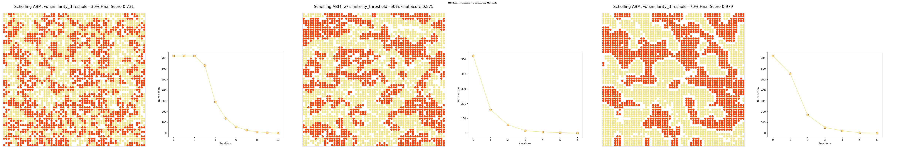

# Schelling Model




## Schelling Experiment
tbd.

This experiment draws inspiration from Thomas Schelling's segregation model, integrating the complexity of political identities and their influence on social dynamics.


## Schelling LLM Model

**Initialisation**
Agents are placed on a grid n*n.
Each of them have a persona initialised from a political spectrum (from fervently conservative to fervently socialist). For instance:
```
system_prompt = You play the role of #name, which defines itself as socialist, living in California. 
#name likes to play basketball and go surfing.
#name believes in equality, and social justice.
```

There is a certain percentage of empty slots in the grid.

**At each steps**:

1. Each agent perceive its local neighborhood as follows:
```
perceptionPROMPT = """Your neighborhood is composed of the following: 
#name, who politically is #message
..."""
```


2. Each agent may decide to STAY or MOVE of position in the grid.
```
updatePROMPT = """Reflect upon this context, to see if #name feels comfortable in this neighborhood. 
You (#name) can decide either to move to another neighborhood, or to stay in this current neighborhood. 
However, keep in mind that relocating require some time, money and effort on your part. You have to balance out comfort and effort realistically. Respond with "MOVE" if #name wish to change your neighborhood, or "STAY" if #name prefer to remain in the neighborhood."""
```
If an agent move, it will be moved to only to a neighborhood with more similar neighbors (if any), and this move would be sampled randomly with weights following the attractiveness (as similarlity) of the neighborhood.


## Schelling ABM Model
tbd


